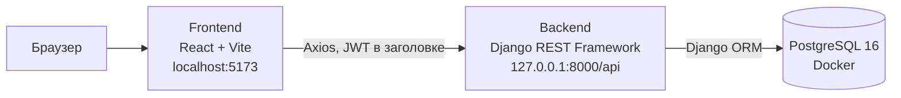
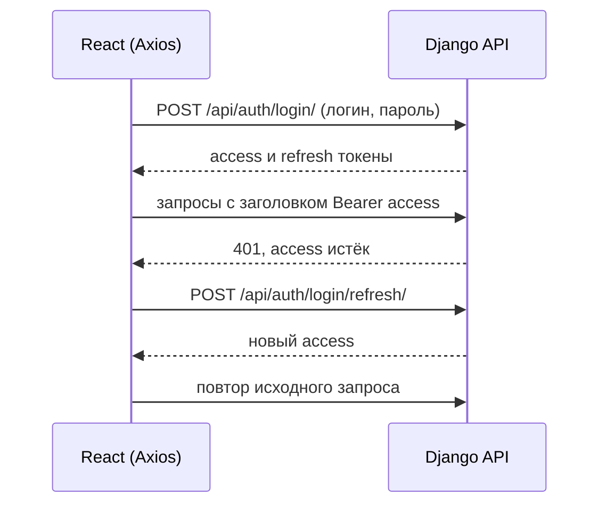

# Евпатория: ВДЖ (Всё для жизни)

Каталог государственных и муниципальных организаций города Евпатория: поиск по названию и адресу, фильтр по категориям, страница организации, личный кабинет с избранным.

Дипломный проект по курсу «Разработка веб-проектов на Python» (Академия ТОП).

## Возможности

- Каталог организаций с поиском (без учёта регистра) и фильтром по категориям
- Страница организации: категория, адрес, телефон, описание
- Регистрация и вход по JWT, автоматическое обновление токена
- Избранное: добавление и удаление организаций, отдельная страница «Моё избранное», фильтр «только избранное» в каталоге
- Админ-панель Django для управления организациями и категориями
- Импорт организаций из CSV одной командой

## Стек

| Слой | Технологии |
|------|-----------|
| Бэкенд | Python, Django, Django REST Framework, SimpleJWT, django-filter, django-cors-headers |
| Фронтенд | React, Vite, React Router, Axios |
| База данных | PostgreSQL 16 (в Docker) |

## Архитектура



Вход и обновление токена:



## Структура репозитория

```
vdzh/
├── backend/                 # Django-проект
│   ├── vdzh/                # настройки и корневые urls
│   ├── accounts/            # пользователь, регистрация, /auth/me/
│   ├── organizations/       # организации, категории, фильтры, импорт из CSV
│   ├── favorites/           # избранное
│   ├── data/                # organizations_import.csv
│   ├── organizations_backup.json   # фикстура: 13 организаций
│   └── .env.example         # шаблон переменных окружения
├── frontend/                # React-приложение
│   └── src/
│       ├── api/             # axios-клиент и обёртки над эндпоинтами
│       ├── context/         # AuthContext
│       ├── components/      # Header, карточка, фильтры, кнопка избранного
│       └── pages/           # каталог, организация, избранное, вход, регистрация
├── docker-compose.yml       # PostgreSQL
└── requirements.txt         # зависимости бэкенда
```

## Запуск с нуля

Понадобятся: Git, Python, Node.js и Docker Desktop. Проект разрабатывался и проверялся на Python 3.14, Node.js 24 и Docker 29.

### 1. Клонирование

```bash
git clone https://github.com/VladCheresh/efl-project.git
cd efl-project
```

### 2. Переменные окружения

Скопируйте шаблон и заполните значения:

```bash
cp backend/.env.example backend/.env
```

В `backend/.env` замените `SECRET_KEY` и `POSTGRES_PASSWORD`. Ключ можно сгенерировать так:

```bash
python -c "import secrets; print(secrets.token_urlsafe(50))"
```

Файл `.env` не попадает в репозиторий. Не используйте в значениях символы `$`, `#`, кавычки и пробелы: они ломают чтение файла Docker Compose.

### 3. База данных

Из корня проекта:

```bash
docker compose --env-file backend/.env up -d db
```

Подождите несколько секунд, пока PostgreSQL запустится (`docker compose ps` должен показать статус `Up`).

### 4. Бэкенд

```bash
cd backend
python -m venv venv
source venv/Scripts/activate      # Windows (Git Bash); Linux/macOS: source venv/bin/activate
pip install -r ../requirements.txt

python manage.py migrate
python manage.py loaddata organizations_backup.json
python manage.py import_organizations data/organizations_import.csv
python manage.py createsuperuser
python manage.py runserver
```

Порядок важен: сначала фикстура `organizations_backup.json` (у неё фиксированные id), затем импорт из CSV. После обеих команд в базе будет 43 организации и 11 категорий. Импорт можно запускать повторно: уже существующие организации пропускаются.

### 5. Фронтенд

В новом терминале:

```bash
cd frontend
npm install
npm run dev
```

## Адреса

| Что | Адрес |
|-----|-------|
| Сайт | http://localhost:5173 |
| API | http://127.0.0.1:8000/api/ |
| Админ-панель | http://127.0.0.1:8000/admin/ |

## Переменные окружения (`backend/.env`)

| Переменная | Назначение |
|------------|-----------|
| `SECRET_KEY` | секретный ключ Django (им же подписываются JWT) |
| `DEBUG` | `True` для разработки, по умолчанию `False` |
| `ALLOWED_HOSTS` | разрешённые хосты, через запятую |
| `CORS_ALLOWED_ORIGINS` | адреса фронтенда, через запятую |
| `POSTGRES_DB`, `POSTGRES_USER`, `POSTGRES_PASSWORD` | параметры базы (те же значения использует `docker-compose.yml`) |
| `POSTGRES_HOST`, `POSTGRES_PORT` | адрес базы, по умолчанию `localhost:5432` |

## API

| Метод | Адрес | Доступ | Описание |
|-------|-------|--------|----------|
| POST | `/api/auth/register/` | все | регистрация (`username`, `password`, `phone`) |
| POST | `/api/auth/login/` | все | вход, возвращает `access` и `refresh` |
| POST | `/api/auth/login/refresh/` | все | новый `access` по `refresh` |
| GET | `/api/auth/me/` | авторизованные | данные текущего пользователя |
| GET | `/api/organizations/` | все | список организаций |
| GET | `/api/organizations/{id}/` | все | одна организация |
| GET | `/api/categories/` | все | список категорий |
| GET | `/api/favorites/` | авторизованные | избранное пользователя |
| POST | `/api/favorites/` | авторизованные | добавить в избранное (`organization`) |
| DELETE | `/api/favorites/{id}/` | авторизованные | убрать из избранного |

Параметры списка организаций:

- `category` — id категории
- `search` — подстрока в названии или адресе, без учёта регистра
- `is_favorite` — `true` или `false`, фильтр по избранному текущего пользователя

Авторизованные запросы передают заголовок `Authorization: Bearer <access>`.

## Модель данных

- **Category**: `name` (уникальное)
- **Organization**: `name`, `category` (ForeignKey), `address`, `phone`, `description`
- **User** (расширяет `AbstractUser`): добавлено поле `phone`
- **Favorite**: `user`, `organization`, `created_at`; пара `user` + `organization` уникальна

## Аутентификация

Используется JWT (SimpleJWT). Access-токен живёт 30 минут, refresh-токен 7 дней. Фронтенд хранит токены в `localStorage`, подставляет access-токен в каждый запрос и при ответе 401 один раз обновляет его через refresh-токен, после чего повторяет запрос.

## Источники данных

Каталог собран вручную по открытым источникам:

- официальный сайт администрации города: [подведомственные учреждения](https://www.my-evp.ru/deyatelnost/uchrezhdeniya-i-predpriyatiya/podvedomstvennye-uchrezhdeniya/), [структура администрации](https://my-evp.ru/gorodskaya-vlast/administratsiya-goroda/struktura-administratsii/), [телефонный справочник администрации](https://my-evp.ru/gorodskaya-vlast/administratsiya-goroda/telefonnyy-spravochnik/), [телефонный справочник города](https://www.my-evp.ru/telefonnyy-spravochnik/);
- Яндекс Карты и 2ГИС: сверка адресов и телефонов, проверка существования организаций.

Данные носят учебный характер. Адреса и телефоны со временем меняются, перед практическим использованием их нужно проверять на официальных сайтах.

## Вне рамок текущей версии

Карта организаций, отзывы, собственная панель управления данными (вместо админки Django).

## Автор

[VladCheresh](https://github.com/VladCheresh) (vladvin47)
