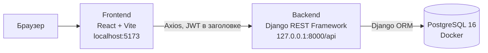
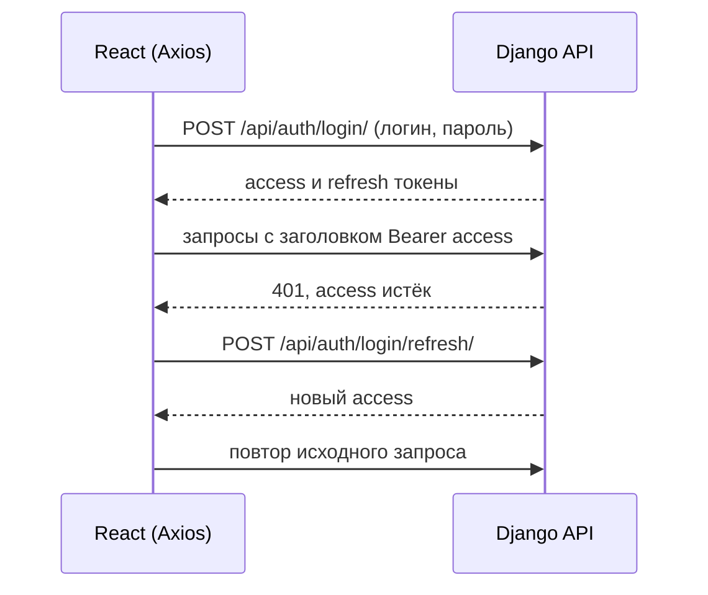

# Евпатория: ВДЖ (Всё для жизни)

Каталог государственных и муниципальных организаций города Евпатория: поиск по названию и адресу, фильтр по категориям, страница организации, личный кабинет с избранным.

Дипломный проект по курсу «Разработка веб-проектов на Python» (Академия ТОП).

**Живая версия:** [evpa-vdzh.onrender.com](https://evpa-vdzh.onrender.com) — см. раздел [Продакшен](#продакшен).

## Возможности

- Каталог организаций с поиском (без учёта регистра) и фильтром по категориям
- Страница организации: категория, адрес, телефон, описание
- Регистрация и вход по JWT, автоматическое обновление токена
- Показ и скрытие пароля при вводе, подтверждение пароля при регистрации
- Избранное: добавление и удаление организаций, отдельная страница «Моё избранное», фильтр «только избранное» в каталоге
- Админ-панель Django для управления организациями и категориями
- Импорт организаций из CSV одной командой, безопасный для повторного запуска
- 23 автотеста бэкенда: аккаунты и JWT, каталог организаций, избранное

## Стек

| Слой | Технологии |
|------|-----------|
| Бэкенд | Python, Django, Django REST Framework, SimpleJWT, django-filter, django-cors-headers, gunicorn, whitenoise |
| Фронтенд | React, Vite, React Router, Axios |
| База данных | PostgreSQL (локально 16 в Docker; на Render управляемый инстанс версии 18) |
| Инфраструктура | Docker, Render (Web Service + Static Site + PostgreSQL) |

## Архитектура


```mermaid
flowchart LR
    B["Браузер"] --> F["Frontend<br/>React + Vite<br/>localhost:5173"]
    F -->|"Axios, JWT в заголовке"| A["Backend<br/>Django REST Framework<br/>127.0.0.1:8000/api"]
    A -->|"Django ORM"| D[("PostgreSQL 16<br/>Docker")]
```

Вход и обновление токена:


```mermaid
sequenceDiagram
    participant F as React (Axios)
    participant A as Django API
    F->>A: POST /api/auth/login/ (логин, пароль)
    A-->>F: access и refresh токены
    F->>A: запросы с заголовком Bearer access
    A-->>F: 401, access истёк
    F->>A: POST /api/auth/login/refresh/
    A-->>F: новый access
    F->>A: повтор исходного запроса
```

Схема одинакова для локальной разработки и для продакшена на Render, меняются адреса и способ размещения базы данных (см. [Продакшен](#продакшен)).

## Структура репозитория

```
vdzh/
├── backend/                 # Django-проект
│   ├── vdzh/                # настройки и корневые urls
│   ├── accounts/            # пользователь, регистрация, /auth/me/, команда ensure_superuser, tests.py
│   ├── organizations/       # организации, категории, фильтры, импорт из CSV, tests.py
│   ├── favorites/           # избранное, tests.py
│   ├── data/                # organizations_import.csv (43 организации) и архивная выгрузка organizations_backup.json
│   ├── entrypoint.sh        # collectstatic + migrate + импорт CSV + создание администратора + запуск gunicorn
│   └── .env.example         # шаблон переменных окружения
├── frontend/                # React-приложение
│   └── src/
│       ├── api/             # axios-клиент и обёртки над эндпоинтами
│       ├── context/         # AuthContext: контекст и провайдер авторизации
│       ├── hooks/           # useAuth
│       ├── components/      # Header, карточка, фильтры, кнопка избранного, PasswordInput
│       └── pages/           # каталог, организация, избранное, вход, регистрация
├── Dockerfile               # образ бэкенда для Render
├── docker-compose.yml       # PostgreSQL для локальной разработки
└── requirements.txt         # зависимости бэкенда
```

Тесты лежат в `tests.py` внутри каждого приложения бэкенда (`accounts`, `organizations`, `favorites`), всего 23.

## Тесты

Бэкенд покрыт автотестами: регистрация и JWT, каталог организаций с поиском и фильтрами, избранное (доступ только для авторизованных, запрет дублей, изоляция записей разных пользователей, запрет `PUT`/`PATCH`).

Запуск (нужен поднятый PostgreSQL, см. [шаг 3](#3-база-данных)):

```bash
cd backend
python manage.py test
```

Ожидаемый результат: `Ran 23 tests ... OK`.

## Запуск с нуля

Понадобятся: Git, Python, Node.js и Docker Desktop. Проект разрабатывался и проверялся на Python 3.14, Node.js 24 и Docker 29.

### 1. Клонирование

```bash
git clone https://github.com/VladCheresh/efl-project.git
cd efl-project
```

### 2. Переменные окружения

Скопируйте шаблон и заполните значения:

```bash
cp backend/.env.example backend/.env
```

В `backend/.env` замените `SECRET_KEY` и `POSTGRES_PASSWORD`. Ключ можно сгенерировать так:

```bash
python -c "import secrets; print(secrets.token_urlsafe(50))"
```

Файл `.env` не попадает в репозиторий. Не используйте в значениях символы `$`, `#`, кавычки и пробелы: они ломают чтение файла Docker Compose.

### 3. База данных

Из корня проекта:

```bash
docker compose --env-file backend/.env up -d db
```

Подождите несколько секунд, пока PostgreSQL запустится (`docker compose ps` должен показать статус `Up`).

### 4. Бэкенд

```bash
cd backend
python -m venv venv
source venv/Scripts/activate      # Windows (Git Bash); Linux/macOS: source venv/bin/activate
pip install -r ../requirements.txt

python manage.py migrate
python manage.py import_organizations data/organizations_import.csv
python manage.py createsuperuser
python manage.py runserver
```

После импорта в базе будет 43 организации и 11 категорий. Команду импорта можно запускать повторно: уже существующие организации пропускаются, дубли не создаются.

### 5. Фронтенд

В новом терминале:

```bash
cd frontend
npm install
npm run dev
```

## Адреса (локальный запуск)

| Что | Адрес |
|-----|-------|
| Сайт | http://localhost:5173 |
| API | http://127.0.0.1:8000/api/ |
| Админ-панель | http://127.0.0.1:8000/admin/ |

## Продакшен

Проект развёрнут на [Render](https://render.com): бэкенд — как Web Service из Docker-образа (`Dockerfile` в корне репозитория), фронтенд — как Static Site, база данных — управляемый PostgreSQL. Бэкенд и база данных находятся в одном регионе (Oregon) и общаются по внутренней сети Render. Фронтенд раздаётся через CDN и к региону не привязан: к API обращается браузер пользователя по публичному адресу, поэтому в `CORS_ALLOWED_ORIGINS` указан адрес сайта.

| Что | Адрес |
|-----|-------|
| Сайт | https://evpa-vdzh.onrender.com |
| API | https://vdzh-backend.onrender.com/api/ |
| Админ-панель | https://vdzh-backend.onrender.com/admin/ |

При деплое backend выполняет по порядку: `collectstatic`, `migrate`, импорт организаций из CSV, создание администратора (`ensure_superuser`), затем запускает `gunicorn` (см. `backend/entrypoint.sh`). Все шаги безопасны для повторного запуска: существующие организации и администратор не дублируются и не изменяются. Статика раздаётся через `whitenoise`, без отдельного веб-сервера.

Бэкенд на бесплатном плане Render засыпает после периода бездействия: первый запрос после паузы может занять до минуты (статический сайт открывается сразу). Бесплатная база данных на Render удаляется через 30 дней после создания (до 27 октября 2026), после этого живая версия перестанет работать без апгрейда или переноса данных.

## Переменные окружения (`backend/.env`)

| Переменная | Назначение |
|------------|-----------|
| `SECRET_KEY` | секретный ключ Django (им же подписываются JWT) |
| `DEBUG` | `True` для разработки, по умолчанию `False` |
| `ALLOWED_HOSTS` | разрешённые хосты, через запятую |
| `CORS_ALLOWED_ORIGINS` | адреса фронтенда, через запятую |
| `POSTGRES_DB`, `POSTGRES_USER`, `POSTGRES_PASSWORD` | параметры базы (те же значения использует `docker-compose.yml`) |
| `POSTGRES_HOST`, `POSTGRES_PORT` | адрес базы, по умолчанию `127.0.0.1:5432` |
| `DJANGO_SUPERUSER_USERNAME`, `DJANGO_SUPERUSER_PASSWORD`, `DJANGO_SUPERUSER_EMAIL` | необязательные: администратор, которого команда `ensure_superuser` создаёт при деплое, если такого пользователя ещё нет. Локально администратора создают через `createsuperuser` |

Переменная фронтенда `VITE_API_URL` — адрес API, подставляется при сборке (`npm run build`). Если она не задана, используется `http://127.0.0.1:8000/api`, поэтому для локального запуска ничего настраивать не нужно.

На Render те же переменные заданы в настройках сервисов: `POSTGRES_HOST` указывает на внутренний адрес базы Render, `CORS_ALLOWED_ORIGINS` содержит адрес сайта, `VITE_API_URL` — адрес бэкенда.

## API

| Метод | Адрес | Доступ | Описание |
|-------|-------|--------|----------|
| POST | `/api/auth/register/` | все | регистрация (`username`, `password`, `phone`) |
| POST | `/api/auth/login/` | все | вход, возвращает `access` и `refresh` |
| POST | `/api/auth/login/refresh/` | все | новый `access` по `refresh` |
| GET | `/api/auth/me/` | авторизованные | данные текущего пользователя |
| GET | `/api/organizations/` | все | список организаций |
| GET | `/api/organizations/{id}/` | все | одна организация |
| GET | `/api/categories/` | все | список категорий |
| GET | `/api/favorites/` | авторизованные | избранное пользователя |
| POST | `/api/favorites/` | авторизованные | добавить в избранное (`organization`) |
| DELETE | `/api/favorites/{id}/` | авторизованные | убрать из избранного |

Параметры списка организаций:

- `category` — id категории
- `search` — подстрока в названии или адресе, без учёта регистра
- `is_favorite` — `true` или `false`, фильтр по избранному текущего пользователя

Авторизованные запросы передают заголовок `Authorization: Bearer <access>`.

## Модель данных

- **Category**: `name` (уникальное)
- **Organization**: `name`, `category` (ForeignKey), `address`, `phone`, `description`
- **User** (расширяет `AbstractUser`): добавлено поле `phone`
- **Favorite**: `user`, `organization`, `created_at`; пара `user` + `organization` уникальна

## Аутентификация

Используется JWT (SimpleJWT). Access-токен живёт 30 минут, refresh-токен 7 дней. Фронтенд хранит токены в `localStorage`, подставляет access-токен в каждый запрос и при ответе 401 один раз обновляет его через refresh-токен, после чего повторяет запрос.

## Источники данных

Каталог собран вручную по открытым источникам:

- официальный сайт администрации города: [подведомственные учреждения](https://www.my-evp.ru/deyatelnost/uchrezhdeniya-i-predpriyatiya/podvedomstvennye-uchrezhdeniya/), [структура администрации](https://my-evp.ru/gorodskaya-vlast/administratsiya-goroda/struktura-administratsii/), [телефонный справочник администрации](https://my-evp.ru/gorodskaya-vlast/administratsiya-goroda/telefonnyy-spravochnik/), [телефонный справочник города](https://www.my-evp.ru/telefonnyy-spravochnik/);
- Яндекс Карты и 2ГИС: сверка адресов и телефонов, проверка существования организаций.

Данные носят учебный характер. Адреса и телефоны со временем меняются, перед практическим использованием их нужно проверять на официальных сайтах.

## Вне рамок текущей версии

Карта организаций, отзывы, собственная панель управления данными (вместо админки Django).

## Автор

[VladCheresh](https://github.com/VladCheresh) (vladvin47)
